# EduDex User Guide

EduDex is a **desktop app for managing student's contacts, optimized for use via a Command Line Interface** (CLI) while still having the benefits of a Graphical User Interface (GUI). 
EduDex is targeted towards technically-able freelance tutors who find it difficult to manage a large number of student contacts. Using EduDex, tutors can easily add the subjects they teach, organize student information, and schedule lessons efficiently.
If you can type fast, EduDex can get your contact management tasks done faster than traditional methods.

<!-- * Table of Contents -->
<page-nav-print />

--------------------------------------------------------------------------------------------------------------------

## Quick start

1. Ensure you have Java `17` or above installed in your Computer.<br>
   **Mac users:** Ensure you have the precise JDK version prescribed [here](https://se-education.org/guides/tutorials/javaInstallationMac.html).

1. Download the latest `.jar` file from [here](https://github.com/AY2526S1-CS2103T-T12-1/tp/releases).

1. Copy the file to the folder you want to use as the _home folder_ for your EduDex.

1. Open a command terminal, `cd` into the folder you put the jar file in, and use the `java -jar edudex.jar` command to run the application.<br>
   A GUI similar to the below should appear in a few seconds, with a pop-up asking you to start by adding subjects. Note how the app contains some sample data.<br>
   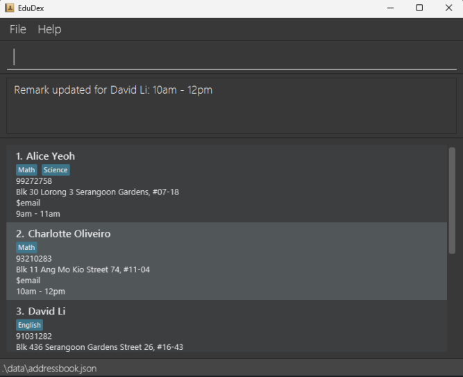

_Initial start-up of Edudex_

1. Type the command in the command box and press Enter to execute it. e.g. typing **`help`** and pressing Enter will open the help window.<br>
   Some example commands you can try:

   * `list` : Lists all contacts.

   * `add n/John Doe p/98765432 sch/Raffles Primary School a/John street, block 123, #01-01` : Adds a contact named `John Doe` to the Address Book.

   * `addsub english` : Adds a subject named `English` to the subject list.
   
   * `addlesson 1 sub/english d/monday start/10:00 end/11:00` : Adds a lesson to the first contact, with a subject of english, day of Monday, and timing from 10:00-11:00
   
   * `editlesson 1 1 d/tuesday` : Edits the first lesson of the first contact, changing day to tuesday
   
   * `find sub/english` : Finds all students with subject English taken 
   
   * `delete 3` : Deletes the 3rd contact shown in the current list.

   * `clear` : Deletes all contacts.

   * `exit` : Exits the app.

1. Refer to the [Features](#features) below for details of each command.

--------------------------------------------------------------------------------------------------------------------

## Features

<box type="info" seamless>

**Notes about the command format:**<br>

* Words in `UPPER_CASE` are the parameters to be supplied by the user.<br>
  e.g. in `add n/NAME`, `NAME` is a parameter which can be used as `add n/John Doe`.

* Items in square brackets are optional.<br>
  e.g `n/NAME [t/TAG]` can be used as `n/John Doe t/strongInMaths` or as `n/John Doe`.

* Items with `…`​ after them can be used multiple times including zero times.<br>
  e.g. `[t/TAG]…​` can be used as ` ` (i.e. 0 times), `t/owesMoney`, `t/owesMoney t/strongInScience` etc.

* Parameters can be in any order.<br>
  e.g. if the command specifies `n/NAME p/PHONE_NUMBER`, `p/PHONE_NUMBER n/NAME` is also acceptable.

* Extraneous parameters for commands that do not take in parameters (such as `help`, `list`, `exit` and `clear`) will be ignored.<br>
  e.g. if the command specifies `help 123`, it will be interpreted as `help`.

* If you are using a PDF version of this document, be careful when copying and pasting commands that span multiple lines as space characters surrounding line-breaks may be omitted when copied over to the application.
</box>

### Viewing help : `help`

Shows a message explaining how to access the help page.

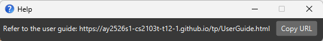

_Help window with link to User Guide_

Format: `help`

### Adding a subject: `addsub`

Adds a subject to EduDex.

Format: `addsub SUBJECT`

**Field Requirements:**
* `SUBJECT` can be any alphanumeric string.
* Subject names are **case-insensitive** (e.g., `Math` is the same as `math`).

<box type="warning" seamless>

**Caution:**
* Duplicate subjects (case-insensitive) are not allowed.
  </box>

Examples:
* `addsub English`
* `addsub MATH`

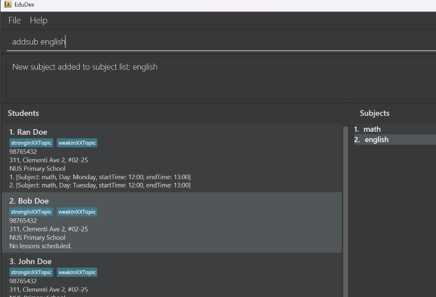

_Subject "english" added successfully._

### Deleting a subject : `delsub`

Deletes the specified subject from EduDex.

Format: `delsub INDEX`

**Field Requirements:**
* `INDEX` must be a **positive integer** (1, 2, 3, …)
* `INDEX` refers to the index number shown in the displayed subject list

Examples:
* `delsub 1` deletes the 1st subject in EduDex.

<box type="warning" seamless>

**Caution:**
* Deleting a subject does **not** automatically remove lessons associated with that subject.
  </box>


### Adding a student: `add`

Adds a student to EduDex.

Format: `add n/NAME p/PHONE_NUMBER sch/SCHOOL a/ADDRESS [t/TAG]`

**Field Requirements:**
* `NAME` should only contain alphanumeric characters and spaces, must not be blank
* `PHONE_NUMBER` should only contain numbers, at least 3 digits long
* `SCHOOL` should only contain alphanumeric characters and spaces, must not be blank
* `ADDRESS` can be any value, must not be blank
* `TAG` (optional) should be alphanumeric

<box type="tip" seamless>

**Note:**
* Names are **case-insensitive** (e.g., `john doe` is the same student as `JOHN DOE`)
* A student can have any number of tags (including 0)
</box>

Examples:
* `add n/John Doe p/98765432 sch/NUS a/John street, block 123`
* `add n/Betsy Crowe sch/Queenstown Primary School a/Clementi p/1234567 t/weakInAlgebra`

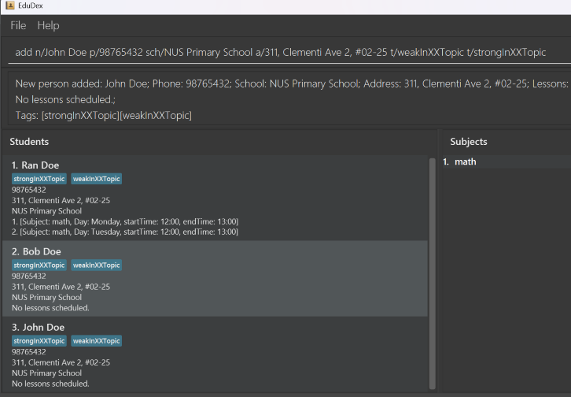

_Student John Doe added successfully._


### Listing all students : `list`

Shows a list of all students in EduDex.

Format: `list`

### Editing a student : `edit`

Edits an existing student fields

* Student fields that can be edited**: Name, Phone Number, School, Address, Tags

Format: 
`edit INDEX [n/NAME] [p/PHONE] [sch/SCHOOL] [a/ADDRESS] [t/TAG]…​`

**Field Requirements:**
* `INDEX` must be a **positive integer** (1, 2, 3, …)
* `INDEX` refers to the index number shown in the displayed student list
* At least one optional field must be provided
* Field constraints are the same as in the [`add`](#adding-a-student-add) command

<box type="tip" seamless>

**Note:**
* When editing tags, the existing tags will be **replaced** (not added to)
* To remove all tags, type `t/` without specifying any tags after it
* To edit a student's **lesson details**, use the [`editlesson`](#editing-a-lesson-editlesson) command instead
</box>

Examples:
*  `edit 1 p/91234567 sch/Jurong Primary School` Edits the phone number and school of the 1st student to be `91234567` and `Jurong Primary School` respectively.
*  `edit 2 n/Betsy Crower t/` Edits the name of the 2nd student to be `Betsy Crower` and clears all existing tags.

|                       Before                       |                      After                       |
|:--------------------------------------------------:|:------------------------------------------------:|
| 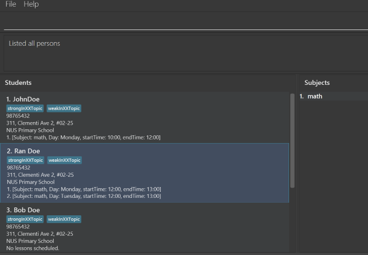 |   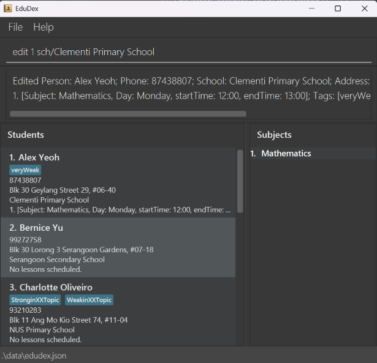    |
|              _Before editing school_               |              _After editing school_              |


### Locating students by Name, Day, or Subject: `find`

Finds students whose **names**, **lesson days**, or **lesson subjects** match the given keywords.

Format:  
`find KEYWORD [MORE_KEYWORDS]`
`find NAME`
`find d/DAY`  
`find sub/SUBJECT`

**Field Requirements:**
* For name search: any alphanumeric keywords
* For day search: valid days of the week (Monday, Tuesday, Wednesday, Thursday, Friday, Saturday, Sunday)
* For subject search: existing subject names in EduDex 

<box type="info" seamless>

**Search Behavior:**
* All searches are **case-insensitive** (e.g., `find hans` matches `Hans`)
* For name search: matches students with at least one keyword (OR search)
* Order of keywords does not matter (e.g., `find Hans Bo` matches `Bo Hans`)
* For `find sub/SUBJECT`: lessons are automatically sorted by day and start time
  </box>

<box type="tip" seamless>

**Tip:** You can search by name, day, or subject independently.  
e.g.
- `find alice` — finds students with names containing "alice".
- `find alex david` — finds both `Alex Yeoh` and `David Li`.
- `find d/Monday` — finds all students with lessons on Monday.
- `find sub/Math` — finds all students taking Math lessons.
  </box>

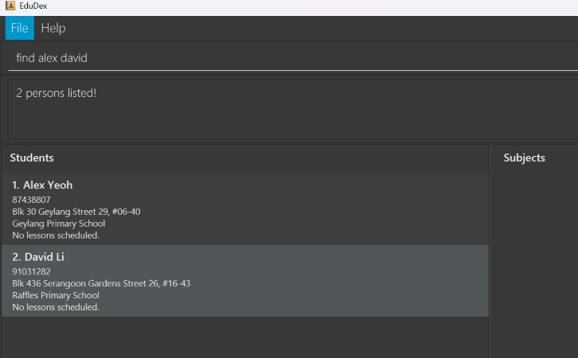

_Find result for names 'Alex' or 'David'_

### Deleting a student : `delete`

Deletes the specified student from EduDex.

Format: `delete INDEX`

**Field Requirements:**
* `INDEX` must be a **positive integer** (1, 2, 3, …)
* `INDEX` refers to the index number shown in the displayed student list

<box type="warning" seamless>

**Caution:**
* This action is irreversible. All student information and associated lessons will be permanently deleted.
</box>

Examples:
* `list` followed by `delete 2` deletes the 2nd student in EduDex.
* `find Betsy` followed by `delete 1` deletes the 1st student in the results of the `find` command.

### Adding a lesson: `addlesson`

Adds a lesson to the student in EduDex, specified by index.

Format: `addlesson STUDENT_INDEX sub/SUBJECT d/DAY start/START_TIME end/END_TIME`

**Field Requirements:**
* `STUDENT_INDEX` must be a **positive integer** not exceeding the size of the displayed student list
* `SUBJECT` must match (case-insensitive) an existing subject in EduDex
* `DAY` must be one of: Monday, Tuesday, Wednesday, Thursday, Friday, Saturday, Sunday (case-insensitive)
* `START_TIME` and `END_TIME` must be in 24-hour format **HH:MM**
* `START_TIME` must be earlier than `END_TIME`

<box type="warning" seamless>

**Caution:**
* The new lesson must not conflict with existing lessons (for any student)
* Lessons extending past midnight must be split into separate lessons
  * Example: A lesson from Monday 22:00 to Tuesday 02:00 should be:
    * Monday 22:00 to 23:59
    * Tuesday 00:00 to 02:00
</box>

Examples:
* `addlesson 1 sub/mathematics d/Monday start/12:00 end/13:00`
* `addlesson 3 d/Tuesday sub/physics start/13:00 end/15:00`

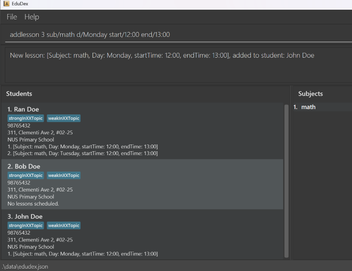

_Lesson "math" added successfully to student John Doe._

### Deleting a lesson from a student: `dellesson`

Deletes a specific lesson (by index) from a given student.

Format: `dellesson STUDENT_INDEX LESSON_INDEX`

**Field Requirements:**
* `STUDENT_INDEX` and `LESSON_INDEX` must be **positive integers** (1, 2, 3, …)
* `STUDENT_INDEX` refers to the student's position in the displayed list
* `LESSON_INDEX` refers to the lesson's position within that student's lesson list


<box type="info" seamless>

**Example:**  
If student 1 has 3 lessons (Math, Science, English),  
`dellesson 1 2` will delete **Science**.
</box>

Examples:
* `dellesson 1 1` — Deletes the first lesson of the first student in the list.
* `dellesson 2 3` — Deletes the third lesson of the second student in the list.

<box type="warning" seamless>

If an invalid index is entered:
* EduDex will display **“Invalid student index.”** if `STUDENT_INDEX` exceeds the size of student list.
* EduDex will display **“Invalid lesson index.”** if `LESSON_INDEX` exceeds the number of lessons for that student. 
</box>

|                          Before                          |                            After                             |
|:--------------------------------------------------------:|:------------------------------------------------------------:|
| 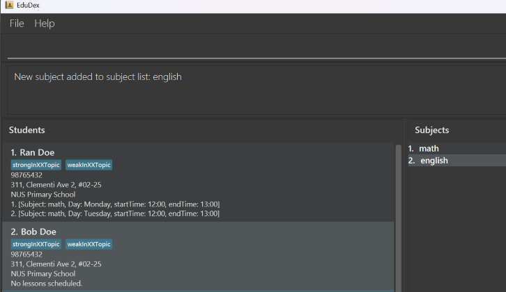 | 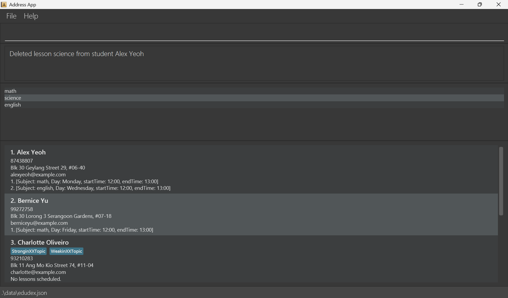 |
|     _Student Ran Doe has 2 lessons before deletion._     |        _Student Ran Doe has 1 lesson after deletion._        |

### Editing a lesson : `editlesson`

Edits an existing lesson for a specific student in EduDex.

Format: `editlesson STUDENT_INDEX LESSON_INDEX [sub/SUBJECT] [d/DAY] [start/START_TIME] [end/END_TIME]`

**Field Requirements:**
* `STUDENT_INDEX` and `LESSON_INDEX` must be **positive integers** (1, 2, 3, …)
* `STUDENT_INDEX` refers to the student's position in the displayed list
* `LESSON_INDEX` refers to the lesson's position in that student's lesson list (shown in `list` command)
* At least one optional field must be provided 
* Lesson field constraints are the same as in the [`addlesson`](#adding-a-lesson-addlesson) command

<box type="warning" seamless>

**Caution:**
* The edited lesson time must not conflict with:
    * Other lessons of the **same student**.
    * Lessons of **other students** (no overlapping times on the same day).
* If changing the subject, ensure it exists in EduDex (use `addsub` first if needed)
* If a subject has been deleted and a lesson still uses it, you must first change the subject field to a valid subject before editing other fields (day, time)
</box>

<box type="tip" seamless>

**Tip:** You can edit just one field at a time or multiple fields together.
- `editlesson 1 1 d/Tuesday` — Changes only the day of the first lesson.
- `editlesson 2 3 start/14:00 end/16:00` — Changes only the timing.
- `editlesson 1 2 sub/Physics d/Wednesday start/10:00 end/12:00` — Changes all fields at once.
  </box>

Examples:
* `editlesson 1 1 d/Wednesday` — Changes the day of the first lesson of the first student to Wednesday.
* `editlesson 2 1 start/14:00 end/16:00` — Changes the timing of the first lesson of the second student to 2:00 PM - 4:00 PM.
* `editlesson 3 2 sub/Chemistry d/Friday start/09:00 end/11:00` — Changes the subject, day, and timing of the second lesson of the third student.


|                      Before                       |                        After                         |
|:-------------------------------------------------:|:----------------------------------------------------:|
|  | 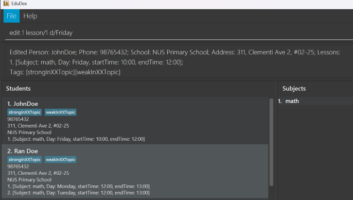 |
|       _Before editing lesson of Alex Yeoh._       |      _After editing lesson day for Alex Yeoh._       |

### Clearing all students : `clear`

Clears all students and subjects from EduDex.

Format: `clear`

### Exiting the program : `exit`

Exits the program.

Format: `exit`

### Saving the data

EduDex data are saved in the hard disk automatically after any command that changes the data. There is no need to save manually.

### Editing the JSON data file

EduDex data are saved automatically as a JSON file `[JAR file location]/data/edudex.json`. Advanced users are welcome to update data directly by editing that data file.


The `edudex.json` file defines the **data model** for managing tutees in the EduDex application.
This is intended for power users who wish to edit `edudex.json` without using the GUI.

<box type="warning" seamless>

**Caution:**
If your changes to the data file makes its format invalid, EduDex will discard all data and start with an empty data file at the next run.  Hence, it is recommended to take a backup of the file before editing it.<br>
Furthermore, certain edits can cause the EduDex to behave in unexpected ways (e.g., if a value entered is outside the acceptable range). Therefore, edit the data file only if you are confident that you can update it correctly.
</box>

#### JSON: Top-Level Overview

```json
{
  "persons": [ ... ], // required
  "subjects": [ ... ] // required
}
```

**Student**
```json
{
  "name": "Full Name", // required, 
  "phone": "At least 3 digit number", // required
  "school": "string", // required
  "address": "Full address string", // required
  "tags": [ "string", ... ], // optional
  "lessons": [ // optional
    {
    "subject": "string",
    "day": "string",
    "startTime": "HH:MM",
    "endTime": "HH:MM"
    }
  ] 
}

```

**Rules**

| Field              | Type              | Constraint                                                                           |
|--------------------|-------------------|--------------------------------------------------------------------------------------|
| `name`             | string            | Alphanumeric Characters and Spaces, must not be blank                                |
| `phone`            | string (ISO 8601) | Number, must be at least 3 digits long                                               |
| `school`           | string            | Alphanumeric Characters and Spaces, must not be blank                                |
| `address`          | string            | Any value, must not be blank                                                         |
| `tags`             | string[]          | Alphanumeric, optional                                                               |
| `lessons`          | Lesson[]          | See fields below                                                                     |
| `lesson:name`      | string            | Alphanumeric Characters and Spaces, must not be blank                                |
| `lesson:day`       | string            | Only one of the following: Monday, Tuesday, Wednesday, Thursday, Friday, Saturday, Sunday |
| `lesson:startTime` | string            | HH:MM (24-hour format), must be a valid time before endTime                          |
| `lesson:endTime`   | string            | HH:MM (24-hour format), must be a valid time after startTime                         |


**Example**
```json
{
  "name": "Alex Yeoh",
  "phone": "87438808",
  "school": "Clementi Village Primary School",
  "address": "Blk 30 Geylang Street 29, #06-40",
  "tags": [
    "prefersMorningLessons",
    "A-levelCandidate"
  ],
  "lessons": [
    {
    "subject": "Science",
    "day": "Monday",
    "startTime": "10:00",
    "endTime": "12:00"
    },
    {
      "subject": "Math",
      "day": "Tuesday",
      "startTime": "14:00",
      "endTime": "16:00"
    }
  ]
}
```

#### JSON: Subject

Each entry in `subjects` defines a distinct academic subject.

**Structure**
```json
{
  "subjectName": "subject title"
}
```

**Rules**
- Each subject **must** have a unique `subjectName`.
- Subject names are **case-insensitive**.
- No duplicate entries allowed.

**Example**
```json
{
  "subjects": [
    { "subjectName": "chemistry" },
    { "subjectName": "physics" },
    { "subjectName": "biology" }
  ]
}
```

**JSON Example**
```json
{
  "persons": {
    "name" : "Bernice Yu",
    "phone" : "99272758",
    "school": "Clementi West Secondary School",
    "address" : "Blk 30 Lorong 3 Serangoon Gardens, #07-18",
    "tags" : [ ],
    "lessons" : [
      {
        "subject": "Science",
        "day": "Monday",
        "startTime": "10:00",
        "endTime": "12:00"
      }
    ]
  },
  "subjects": [
    { "subjectName": "science" }
  ]
}

```
<box type="tip" seamless>

**JSON Tips:**
1. **Formatting**
- Use **UTF-8 encoding**.
- Always maintain **valid JSON syntax**:
    - Double quotes for all keys and strings.
    - No trailing commas.
- Validate the file with a JSON linter before saving.

2. **Adding Entries**
- To add a new student, append a new object to the `persons` array.
- To add a new subject, append a new object to `subjects`.
  </box>

--------------------------------------------------------------------------------------------------------------------

## FAQ

**Q**: How do I transfer my data to another Computer?<br>
**A**: Install the app in the other computer and overwrite the empty data file it creates with the file that contains the data of your previous EduDex home folder.

--------------------------------------------------------------------------------------------------------------------

## Known issues

1. **When using multiple screens**, if you move the application to a secondary screen, and later switch to using only the primary screen, the GUI will open off-screen. The remedy is to delete the `preferences.json` file created by the application before running the application again.
2. **If you minimize the Help Window** and then run the `help` command (or use the `Help` menu, or the keyboard shortcut `F1`) again, the original Help Window will remain minimized, and no new Help Window will appear. The remedy is to manually restore the minimized Help Window.

--------------------------------------------------------------------------------------------------------------------

## Command summary

| Action             | Format, Examples                                                                                                                                                         |
|:-------------------|:-------------------------------------------------------------------------------------------------------------------------------------------------------------------------|
| **Add Student**    | `add n/NAME p/PHONE_NUMBER sch/SCHOOL a/ADDRESS [t/TAG]...`<br>e.g., `add n/James Ho p/22224444 sch/Clementi Primary School a/123, Clementi Rd, 1234665 t/strongInMaths` |
| **Edit Student**   | `edit INDEX [n/NAME] [p/PHONE_NUMBER] [sch/SCHOOL] [a/ADDRESS] [t/TAG]...`<br>e.g., `edit 2 n/James Lee sch/Jurong Primary School`                                       |
| **Delete Student** | `delete INDEX`<br>e.g., `delete 3`                                                                                                                                       |
| **List Students**  | `list`                                                                                                                                                                   |
| **Find Students**  | `find KEYWORD [MORE_KEYWORDS]`<br>`find d/DAY`<br>`find sub/SUBJECT`<br>e.g., `find James`, `find d/Monday`, `find sub/Math`                                             |
| **Add Subject**    | `addsub SUBJECT`<br>e.g., `addsub Mathematics`                                                                                                                           |
| **Delete Subject** | `delsub INDEX`<br>e.g., `delsub 2`                                                                                                                                       |
| **Add Lesson**     | `addlesson STUDENT_INDEX sub/SUBJECT d/DAY start/START_TIME end/END_TIME`<br>e.g., `addlesson 1 sub/Mathematics d/Monday start/12:00 end/13:00`                          |
| **Delete Lesson**  | `dellesson STUDENT_INDEX LESSON_INDEX`<br>e.g., `dellesson 1 2`                                                                                                          |
| **Edit Lesson**    | `editlesson STUDENT_INDEX LESSON_INDEX [sub/SUBJECT] [d/DAY] [start/START_TIME] [end/END_TIME]`<br>e.g., `editlesson 1 1 d/Tuesday`                                      |
| **Clear**          | `clear`                                                                                                                                                                  |
| **Help**           | `help`                                                                                                                                                                   |
| **Exit**           | `exit`                                                                                                                                                                   |
